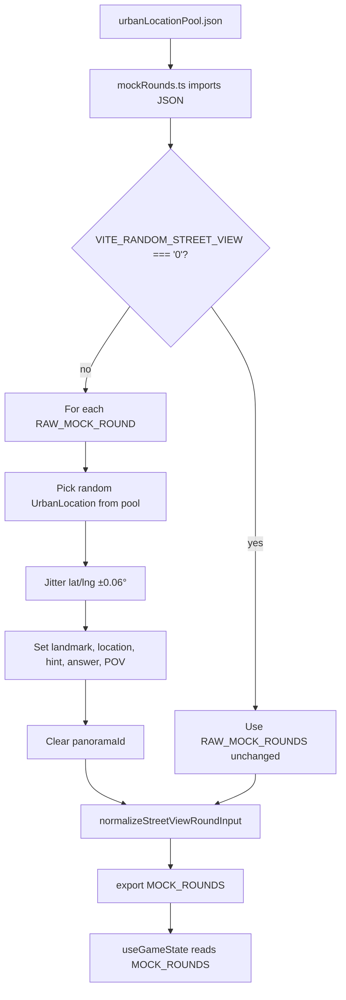
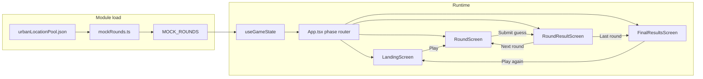
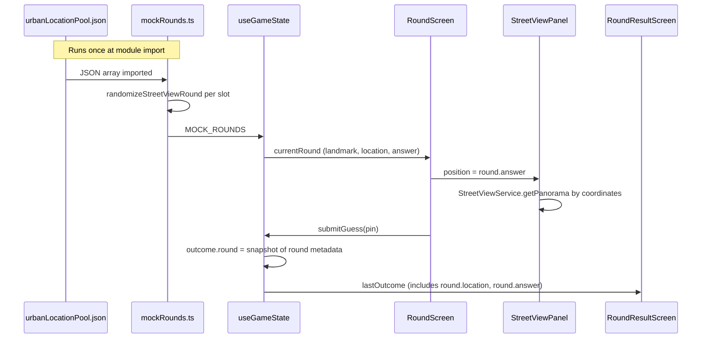
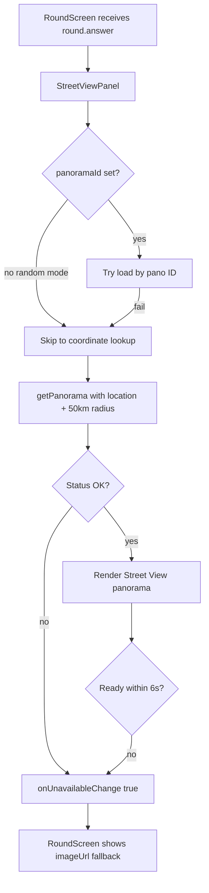

# Urban Location Pool — Flow and Code Reference

This document describes how `src/data/urbanLocationPool.json` is loaded, how random urban rounds are generated, and how those rounds flow through gameplay into the results screens.

---

## Dataset schema

**File:** `src/data/urbanLocationPool.json`

Each entry is a town or city anchor point. Random rounds pick one entry, then jitter coordinates slightly around it.

| Field     | Type   | Description                          |
|-----------|--------|--------------------------------------|
| `city`    | string | City or town name                    |
| `country` | string | Country name                         |
| `lat`     | number | Anchor latitude (decimal degrees)    |
| `lng`     | number | Anchor longitude (decimal degrees)   |

Example entry:

```json
{ "city": "Paris", "country": "France", "lat": 48.8584, "lng": 2.2945 }
```

**Target size:** 300 entries (Cycle 5 work pack). Current pool is a starter subset.

---

## Module initialization flow

Rounds are built once when the app module loads. If random mode is on, each of the five game rounds is rewritten using a random pick from the urban pool.



**Feature toggle**

| Env var                    | Effect                                      |
|----------------------------|---------------------------------------------|
| unset or any value except `0` | Random urban mode **ON** (default)       |
| `VITE_RANDOM_STREET_VIEW=0`   | Curated static rounds (legacy behaviour) |

---

## Gameplay flow

Once `MOCK_ROUNDS` is exported, the game state hook drives the four phases. Round metadata (including the randomized city) is snapshotted into each outcome at submit time so results screens stay consistent.





---

## Street View lookup flow

In random mode, `panoramaId` is cleared so Street View always resolves from coordinates. If lookup fails, `RoundScreen` falls back to the round's stock `imageUrl`.



---

## Code snippets

### 1. Import pool and type

`src/data/mockRounds.ts`

```typescript
import urbanLocationPool from './urbanLocationPool.json';

type UrbanLocation = {
  city: string;
  country: string;
  lat: number;
  lng: number;
};

const URBAN_LOCATIONS = urbanLocationPool as UrbanLocation[];
```

### 2. Feature toggle

`src/data/mockRounds.ts`

```typescript
const RANDOM_STREET_VIEW_ENABLED = import.meta.env.VITE_RANDOM_STREET_VIEW !== '0';
const RANDOM_COORDINATE_JITTER_DEGREES = 0.06;
```

### 3. Random selection from pool

`src/data/mockRounds.ts`

```typescript
function randomizeStreetViewRound(round: MockRound): MockRound {
  const hotspot = URBAN_LOCATIONS[Math.floor(Math.random() * URBAN_LOCATIONS.length)];
  const randomizedAnswer = {
    lat: Number(
      randomInRange(
        hotspot.lat - RANDOM_COORDINATE_JITTER_DEGREES,
        hotspot.lat + RANDOM_COORDINATE_JITTER_DEGREES
      ).toFixed(6)
    ),
    lng: Number(
      randomInRange(
        hotspot.lng - RANDOM_COORDINATE_JITTER_DEGREES,
        hotspot.lng + RANDOM_COORDINATE_JITTER_DEGREES
      ).toFixed(6)
    ),
  };

  return {
    ...round,
    landmark: `${hotspot.city} City Center`,
    location: `${hotspot.city}, ${hotspot.country}`,
    hint: `Randomized urban coordinates near ${hotspot.city}.`,
    answer: randomizedAnswer,
    panoramaId: undefined,
    streetViewPov: {
      heading: Number(randomInRange(0, 360).toFixed(2)),
      pitch: Number(randomInRange(-8, 8).toFixed(2)),
    },
  };
}
```

### 4. Build exported rounds

`src/data/mockRounds.ts`

```typescript
const roundSource = RANDOM_STREET_VIEW_ENABLED
  ? RAW_MOCK_ROUNDS.map(randomizeStreetViewRound)
  : RAW_MOCK_ROUNDS;

export const MOCK_ROUNDS: MockRound[] = roundSource.map((round) => {
  const normalizedStreetView = normalizeStreetViewRoundInput(round);

  return {
    ...round,
    answer: normalizedStreetView.answer,
    ...(normalizedStreetView.panoramaId ? { panoramaId: normalizedStreetView.panoramaId } : {}),
    streetViewPov: normalizedStreetView.streetViewPov,
  };
});
```

### 5. Game state consumes rounds

`src/hooks/useGameState.ts`

```typescript
import { MOCK_ROUNDS } from '../data/mockRounds';

function submitPin(state: State, pin: Coords): State {
  const round = MOCK_ROUNDS[state.roundIndex];
  const distanceKm = haversineKm(pin, round.answer);
  const outcome: RoundOutcome = {
    roundIndex: state.roundIndex,
    round: {
      landmark: round.landmark,
      location: round.location,
      answer: round.answer,
    },
    distanceKm,
    score: scoreFromDistance(distanceKm),
    rating: ratingFromScore(scoreFromDistance(distanceKm)),
    guess: pin,
  };
  // ...
}

const currentRound = MOCK_ROUNDS[state.roundIndex];
```

### 6. Round screen passes answer to Street View

`src/screens/RoundScreen.tsx`

```typescript
const RANDOM_STREET_VIEW_ENABLED = import.meta.env.VITE_RANDOM_STREET_VIEW !== '0';

<StreetViewPanel
  position={round.answer}
  panoramaId={roundWithStreetView.panoramaId}
  defaultPov={roundWithStreetView.streetViewPov}
  onUnavailableChange={setFallbackActive}
/>
```

### 7. Coordinate-based Street View lookup

`src/components/StreetViewPanel.tsx`

```typescript
if (!targetPanoId) {
  const coordinateResult = await getPanorama({
    location: position,
    radius: 50000,
    source: google.maps.StreetViewSource.OUTDOOR,
    preference: google.maps.StreetViewPreference.NEAREST,
  });
  if (coordinateResult.status !== google.maps.StreetViewStatus.OK) {
    onUnavailableChange?.(true);
    return;
  }
  targetPanoId = coordinateResult.data.location.pano;
}
```

### 8. Results use persisted snapshot (not live pool lookup)

`src/screens/RoundResultScreen.tsx`

```typescript
<MapLegend location={outcome.round.location} />
<ResultMap answer={outcome.round.answer} guess={outcome.guess} />
<ResultStatsBar
  landmark={outcome.round.landmark}
  location={outcome.round.location}
  // ...
/>
```

`src/screens/FinalResultsScreen.tsx`

```typescript
{outcomes.map((outcome) => (
  <tr key={outcome.roundIndex}>
    <td>{outcome.round.location}</td>
    {/* distance, score from outcome */}
  </tr>
))}
```

---

## File map

| File | Role |
|------|------|
| `src/data/urbanLocationPool.json` | Curated urban anchor coordinates |
| `src/data/mockRounds.ts` | Loads pool, randomizes rounds, exports `MOCK_ROUNDS` |
| `src/utils/streetView.ts` | Normalizes coords and POV before export |
| `src/hooks/useGameState.ts` | Reads `MOCK_ROUNDS`, snapshots round into outcomes |
| `src/screens/RoundScreen.tsx` | Renders Street View from `round.answer` |
| `src/components/StreetViewPanel.tsx` | Resolves panorama from coordinates |
| `src/screens/RoundResultScreen.tsx` | Shows outcome snapshot on map |
| `src/screens/FinalResultsScreen.tsx` | Lists all outcome locations |

---

## Related work packs

- `implementation/work-pack-wave1-cycle4-random-streetview.md` — random coordinate experiment
- `implementation/work-pack-wave1-cycle5-urban-dataset.md` — expand pool to 300 entries
